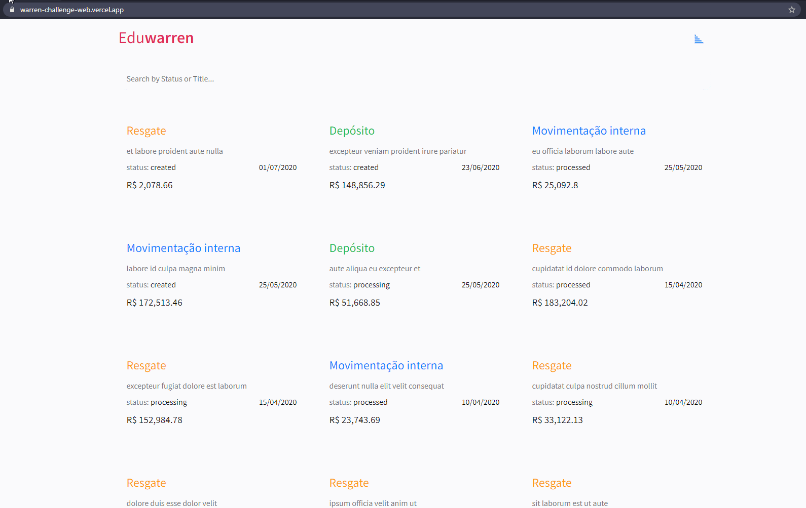
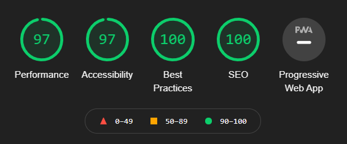

# 📊 Warren Challenge Web

<a href="https://github.com/warrenbrasil/desafio-warren-web" target="_blank">Challenge</a> web done with React for the company <a href="https://warren.com.br/" target="_blank">Warren</a>.

- You can check the challenge done <a href="https://warren-challenge-web.vercel.app/" target="_blank">here</a>.

## Preview
<div align="center">
  <a href="https://warren-challenge-web.vercel.app/" target="_blank">
    
  </a>  
</div>

## Lighthouse
<div align="center">
  
</div>

## Endpoint [API]

- [/transactions](https://warren-transactions-api.herokuapp.com/api/transactions)
- [/transactions/:id](https://warren-transactions-api.herokuapp.com/api/transactions/5f89f9f257fe42957bf6dbfd)
## Technologies

This project uses these technologies:

- [React](https://reactjs.org/)
- [Styled Components](https://styled-components.com/)
- [React Icons](https://react-icons.github.io/react-icons/)
- [Cypress](https://www.cypress.io/)
- [MirageJs](https://miragejs.com/)
- [Axios](https://github.com/axios/axios)
- [Vercel](https://vercel.com/)

## Commands

### Install Dependencies

```npm
npm install
```

### Run Unit Tests

```npm
npm run test
```
with percentage covered
```npm
npm run test -- --coverage --watchAll=false
```
### Run Cypress Tests

```npm
npx cypress open
```

### Build

```npm
npm run build
```

### Run Project

```npm
npm start
```

Developed by <a href="https://www.linkedin.com/in/eduardo-dos-santos-dusik-095100120/" target="_blank">Eduardo Dusik</a>
